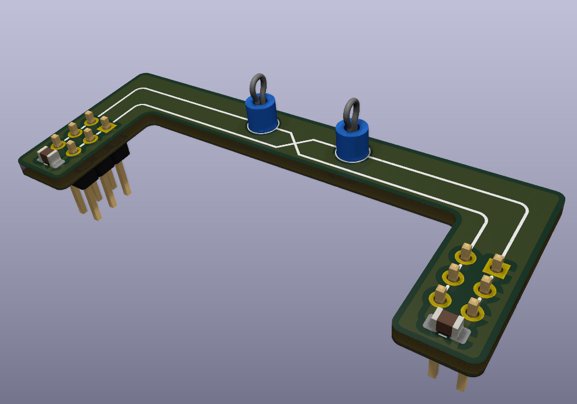

# Breadboard Power Jumper

The *Breadboard Power Jumper* connects the edge rails (bus strips) of a standard solderless breadboard together while also providing clip points for power leads. This design was heavily influenced by a design from [IMSAI Guy](https://www.youtube.com/watch?v=gdtfjXa2s7k&t) with with slight modifications to the pcb shape and with the addition of manufactured test points.

## BOM
| Item | Description | Qty | Notes |
| ---- | ----------- | --- | ----- |
| PCB  | PCB | 1 | manufactured by PCB prototype service |
| Test Point | [Keystone Electronics 5280](https://www.digikey.com/en/products/detail/keystone-electronics/5280/12751667) | 1 | Red |
| Test Point | [Keystone Electronics 5281](https://www.digikey.com/en/products/detail/keystone-electronics/5281/12751648) | 1 | Black |
| Male Header | [Adam Tech PH2-06-UA](https://www.digikey.com/en/products/detail/adam-tech/PH2-06-UA/9830396) | 2 | any similar 6 position 2 row male header will work|
| 0.1uF 0805 Capacitor | | 2 | Optional or maybe [10uF](https://blog.poly.nomial.co.uk/2025-01-25-proper-decoupling-practices-and-why-you-should-leave-100nf-behind.html) |

## Directory Outline
- [`~/mechanical/`](mechanical): FreeCAD file generated using KiCadStepUp plugin
- [`~/pcb/`](pcb): KiCAD design files
    - [`/pcb/gerber`](pcb/gerber/): files for upload to PCB manufacturing service
    - [`/pcb/pcb_render`](pcb/pcb_render/): PNG image of PCB exported from KiCAD 3D viewer
    - [`/pcb/schematic_pdf`](pcb/schematic_pdf/): schematic exported from KiCAD as a PDF